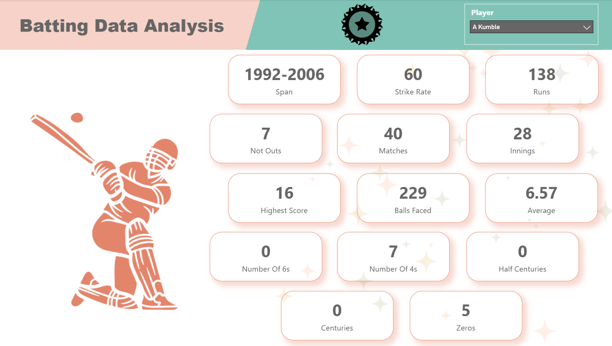
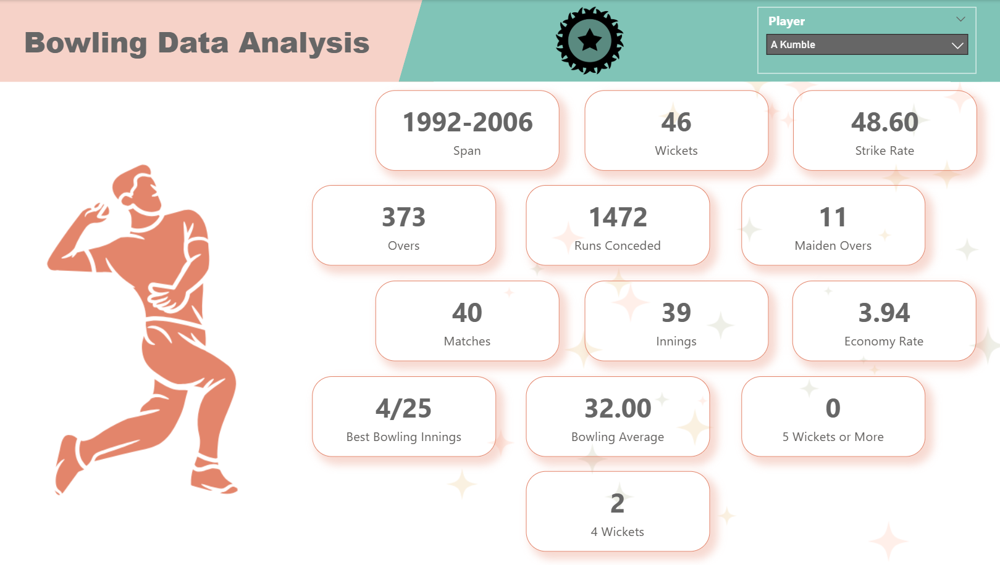

# 🏏 ESPN Cricket Data Analysis (India vs South Africa) – Power BI Project

This repository contains my **Power BI dashboard project** built on real cricket data sourced from the ESPN Cricket website.
As a passionate Cricket lover and a data enthusiast, I designed this dashboard to explore and analyze player and team performances with **Batting, Bowling, and Fielding insights**.

## 📌 Project Overview

Cricket is not just about runs and wickets — it’s about performance patterns, consistency, and game-changing moments.
In this project, I collected this data from **ESPN Cricket** (India vs South Africa ODI Series) and built an **interactive Power BI dashboard**.

The dashboard is divided into **3 key sections**:

🏏 **Batting Performance:** Runs, Strike Rate, Boundaries, Highest Score

🎯 **Bowling Performance:** Wickets, Economy Rate, Bowling Average, Best Bowling Innings

🧤 **Fielding Performance:** Catches, Number of Stumpings, Dismissals per Innings

Additionally, it includes match-level **comparisons, timelines, and overall insights**.

## 🚀 Live Dashboard

👉 https://app.powerbi.com/view?r=eyJrIjoiMDQ1MGQwN2MtY2FhZi00MGNjLThmZTMtZDg3YzZlNTVlNWJlIiwidCI6ImFiZmY0OWU3LWE3NGMtNGE1Zi04MmQwLWM4NTUyN2Q3NjQ3YSJ9

(Best viewed on desktop for full interactivity.)

## 🛠️ Tools & Technologies

**Data Source**: ESPN Cricket (Match Statistics)

**Data Cleaning & Modelling**: Power BI

**Visualization & Design**: Power BI Desktop

**Sharing & Collaboration**: Power BI Service (Publish to Web enabled)

## 🎯 Skills Demonstrated

Data Collection from web sources

Data Transformation, Cleaning & Data Modelling in Power Query, Power BI

Creating dedicated sections for Batting, Bowling, and Fielding performance

Designing Interactive Dashboards & Filters

Publishing dashboards to Power BI Service for public access

## 📸 Dashboard Preview

## 🏆 About the Author

This Project is created by **Anjan Paul**, a Sports enthusiast and data analytics learner at **Data Space Academy**.
It represents my passion for cricket and my journey in **Data Visualization & Analytics**.

## 📌 How to Reproduce

Clone or download this repository.

Open the .pbix file in Power BI Desktop.

Ensure you have access to the ESPN Cricket dataset (or refresh with your own cricket data).

Explore and customize the dashboard as needed.

## 🔖 License

This repository is licensed under the [MIT License](./LICENSE)
.

⚠️ Note: The cricket match data used in this project was sourced from **ESPN Cricket**.
All rights to the data remain with **ESPN**.
This project is shared strictly for **educational and portfolio purposes only**.
