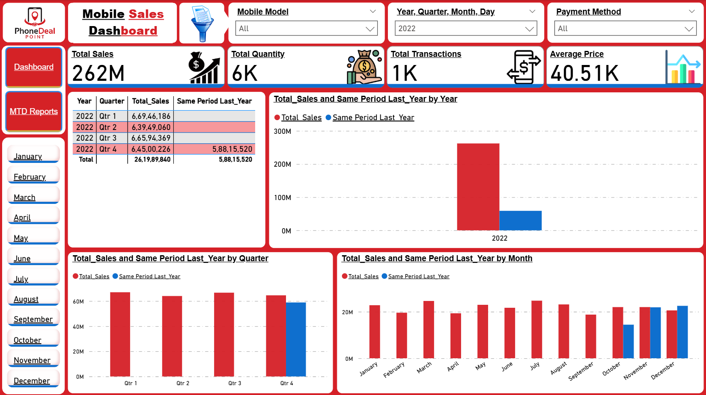

# 📱 Point Mobile — Mobile Sales Performance Dashboard

## Introduction

**Point Mobile —  Mobile Sales Performance Dashboard** is a Power BI project developed to analyze and visualize mobile device sales data. It uncovers trends in **sales performance** across different time frames **(months, quarters, and years)**, **geographic regions**, **payment methods**, and **mobile brands**.

By presenting key metrics and interactive charts, the dashboard provides an intuitive view of the sales landscape. Stakeholders can quickly understand underlying patterns and insights in the mobile sales data.

 ---
## Problem Statement

Businesses often face a lack of clear visibility into mobile sales performance. It can be challenging to track which regions are driving the most sales, how various payment methods contribute to revenue, or how current sales compare to previous periods.

Without a consolidated view of these metrics and trends, decision-makers lack the data-driven insights needed for effective sales planning and marketing. The Mobile Sales Dashboard addresses this problem by consolidating sales data into interactive visualizations, empowering decision-makers with actionable insights.
 
 ---
## Tools and Technologies Used

**Power BI:** For data modeling and creating interactive dashboard visualizations.

**Power Query:** To transform and clean the data before analysis.

**Kaggle:** Source of the mobile sales dataset used in this project.
 
 ---
## Data Source

Mobile sales dataset (collected from Kaggle).
 
 ---
## Features of the Dashboard

**Key Metrics:** Displays total sales, total quantity sold, and average price.

**Time-Based Trends:** Shows sales trends over time (month-to-date, quarter-to-date, and year-to-date).

**Year-Over-Year Comparison:** Compares current sales with the same period last year.

**Brand and Model Analysis:** Performance breakdown by mobile brand and model.

**Geographic Analysis:** Region-wise sales visualized on a map of India.

**Customer Insights:** Distribution of customer ratings.

**Payment Breakdown:** Distribution of payment methods used by customers.

**Temporal Breakdowns:** Day-wise and month-wise sales analysis.
 
 ---
## Features of the Dashboard

**Key Metrics:** Displays total sales, total quantity sold, and average price.

**Time-Based Trends:** Shows sales trends over time (month-to-date, quarter-to-date, and year-to-date).

**Year-Over-Year Comparison:** Compares current sales with the same period last year.

**Brand and Model Analysis:** Performance breakdown by mobile brand and model.

**Geographic Analysis:** Region-wise sales visualized on a map of India.

**Customer Insights:** Distribution of customer ratings.

**Payment Breakdown:** Distribution of payment methods used by customers.

**Temporal Breakdowns:** Day-wise and month-wise sales analysis.

 ---
## Images and Screenshot Descriptions

**Total Sales:** 
Shows detailed sales metrics by location, brand, and mobile model. The report includes a map chart highlighting sales distribution across different regions of India. It also includes pie charts showing the breakdown of payment methods and line charts illustrating month-by-month sales trends. This comprehensive view allows users to pinpoint top-performing regions, popular brands/models, and payment preferences.

 ---
**MTD_QTD Reports:** 
Visualizes month-to-date sales growth trends using line charts. The screenshot highlights key metrics (total sales, quantity sold, transactions, and average price) at the top. The main line chart shows the daily cumulative sales through the selected month, providing insight into how sales accumulate over time. This view is filtered to show data for cash transactions, emphasising cash-payment trends.

 ---
**Same Period Last Year:** 
Compares total sales with the same period last year using bar charts broken down by year, quarter, and month. The visual displays side-by-side bars for the current and previous year, making it easy to see growth or decline in each period. Cumulative totals are shown on top of each bar group, providing a clear comparative analysis of year-over-year sales performance.

 
 --- 
## How to View the Dashboard

**1.Download** the `.pbix` file from this repository (if you want to open it locally).

**2.Open Microsoft Power BI Desktop** and load the `.pbix` file.

**3.Or view the Published Report Online:** 
open the Power BI web link- https://app.powerbi.com/view?r=eyJrIjoiZDk4ZTM3ODgtMTQyMy00OGZlLWI2YTctNjNmNmM5MDg1MzlmIiwidCI6ImFiZmY0OWU3LWE3NGMtNGE1Zi04MmQwLWM4NTUyN2Q3NjQ3YSJ9
 
 ---
## Author and Attribution

**Author:** Anjan Paul — Student Of **Data Space Academy**.

Data Source: Mobile sales dataset collected from **Kaggle**.
 
 ---
## License

This project is licensed under the MIT License.
